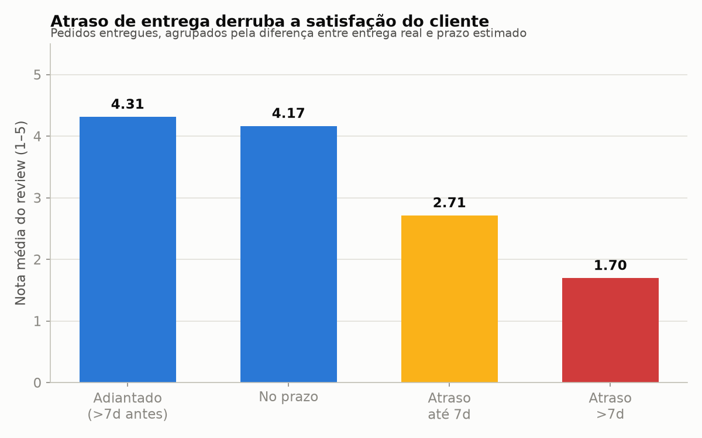
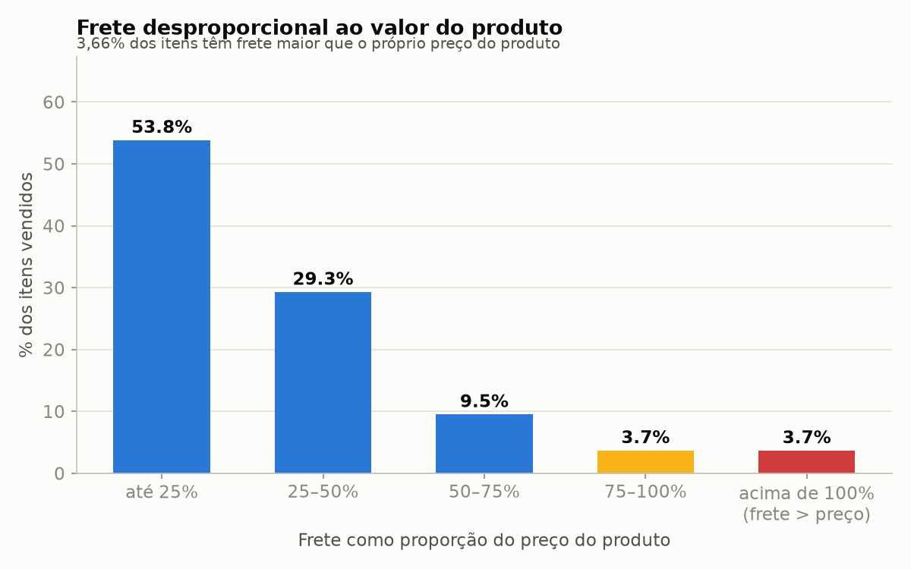
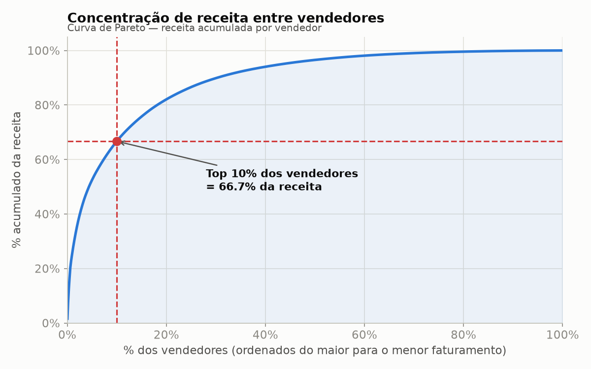

# Plano de Negócio — Ações a partir dos achados críticos

Este documento parte dos 3 achados do rank crítico em `ANALISE_NEGOCIO.md` e propõe, para cada um, um plano de ação concreto. Os gráficos usados como base foram gerados por `analise.py` a partir de `output/*.parquet`.

---

## 1. Atraso de entrega derruba a nota do cliente

**Problema identificado:** a nota média cai de 4,31 (entrega adiantada) para 1,70 (atraso acima de 7 dias) — uma queda de quase 3 pontos em uma escala de 5. 6,77% dos pedidos entregues chegam após o prazo estimado.

### Plano de ação: revisão da estimativa de prazo + gestão de transportadora

1. **Diagnóstico (2–3 semanas):** segmentar `delivery_delay_days` por transportadora, estado de destino e categoria de produto para identificar se o atraso está concentrado em rotas/parceiros específicos ou é generalizado.
2. **Curto prazo (0–1 mês):** tornar a estimativa de prazo exibida ao cliente mais conservadora nas rotas com histórico de atraso (melhor prometer 10 dias e entregar em 8 do que prometer 5 e entregar em 9) — isso já eleva a nota média mesmo sem mudar a logística, pois o gráfico mostra que "adiantado" pontua melhor que "no prazo".
3. **Médio prazo (1–3 meses):** renegociar SLA com as transportadoras responsáveis pelas rotas piores, com penalidade contratual por atraso acima de X dias.
4. **Acompanhamento:** monitorar `delivery_delay_days` e `review_score` mensalmente como par (o mesmo cruzamento deste gráfico) para validar se as mudanças reduzem a cauda de atraso >7 dias.

---

## 2. Frete desproporcional ao valor do produto

**Problema identificado:** 3,7% dos itens vendidos têm frete maior que o próprio preço do produto, e outros 3,7% têm frete entre 75–100% do preço — quase 7,5% dos itens com frete próximo ou acima do valor do produto, concentrado tipicamente em produtos de baixo ticket.

### Plano de ação: política de frete por faixa de valor

1. **Diagnóstico (1–2 semanas):** cruzar os itens com razão frete/preço > 75% com categoria de produto e peso/dimensões (`dim_products`) para confirmar se é um problema de precificação de frete por peso ou de produtos de baixo valor unitário.
2. **Curto prazo (0–1 mês):** definir um **frete mínimo fixo subsidiado** para produtos abaixo de um valor de corte (ex.: produtos < R$30 pagam frete fixo de R$X, com a diferença absorvida na margem ou repassada ao vendedor).
3. **Médio prazo (1–3 meses):** oferecer **frete grátis condicionado** a valor mínimo de carrinho, incentivando o cliente a comprar mais itens por pedido (reduz também o problema de "1 vendedor por pedido" citado nos achados moderados, ao incentivar consolidação).
4. **Acompanhamento:** medir a % de itens com razão frete/preço > 75% a cada trimestre; meta de redução progressiva (ex.: de 7,5% para 4% em 2 trimestres).

---

## 3. Concentração de receita entre vendedores

**Problema identificado:** os 10% dos vendedores mais fortes (309 de 3.095) concentram 66,7% de toda a receita da plataforma — risco de dependência operacional em um grupo pequeno de sellers.

### Plano de ação: programa de retenção para top sellers + ativação da cauda longa

1. **Diagnóstico (2 semanas):** identificar nominalmente os ~100–300 vendedores do topo da curva e mapear risco de saída (tempo de casa, exclusividade, sinais de insatisfação via reviews/tempo de resposta).
2. **Retenção do topo (0–2 meses):** criar programa de conta dedicada para os vendedores-chave (gerente de relacionamento, condições comerciais diferenciadas, prioridade em disputas), reduzindo o risco de perda desses sellers.
3. **Ativação da cauda longa (1–4 meses):** investigar por que 90% dos vendedores geram apenas 33,3% da receita — testar hipóteses de baixa visibilidade na busca/recomendação, poucos produtos cadastrados ou falta de suporte a novos sellers; lançar programa de onboarding/mentoria para sellers pequenos com potencial de crescimento.
4. **Acompanhamento:** recalcular a curva de Pareto trimestralmente; meta de reduzir a concentração no topo (ex.: top 10% caindo de 66,7% para uma faixa mais saudável, indicando crescimento da cauda) sem perder receita absoluta do topo.

---

*Gráficos gerados por `analise.py` a partir dos datasets `output/fact_orders.parquet` e `output/fact_order_items.parquet`. Ver `ANALISE_NEGOCIO.md` para o detalhamento numérico completo de cada achado.*
